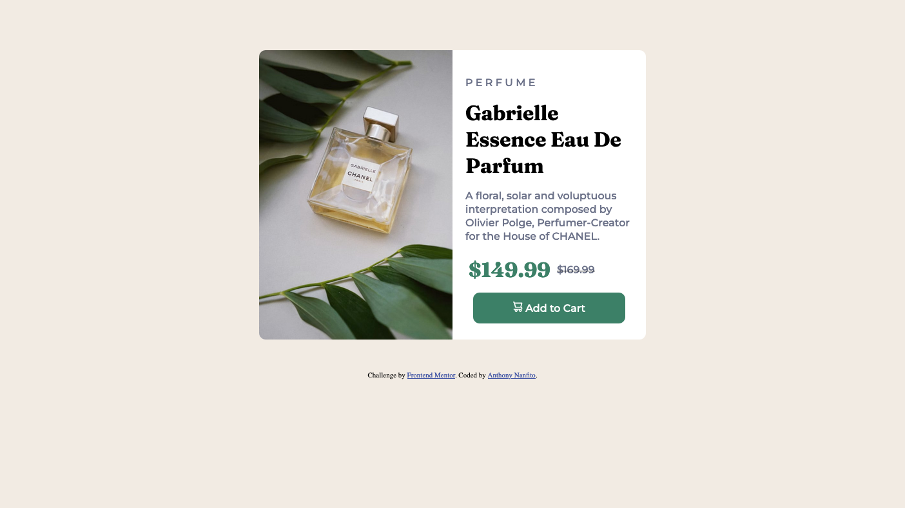

# Frontend Mentor - Product preview card component solution

This is a solution to the [Product preview card component challenge on Frontend Mentor](https://www.frontendmentor.io/challenges/product-preview-card-component-GO7UmttRfa). Frontend Mentor challenges help you improve your coding skills by building realistic projects.

## Table of contents

- [Overview](#overview)
  - [The challenge](#the-challenge)
  - [Screenshot](#screenshot)
  - [Links](#links)
- [My process](#my-process)
  - [Built with](#built-with)
  - [What I learned](#what-i-learned)
  - [Continued development](#continued-development)
  - [Useful resources](#useful-resources)
- [Author](#author)
- [Acknowledgments](#acknowledgments)

## Overview

### The challenge

Build out a product preview card component and get it looking as close to the design as possible.

Users should be able to:

- View the optimal layout depending on their device's screen size
- See hover and focus states for interactive elements

### Screenshot

#### Desktop



#### Mobile


### Links

- Solution URL: [Add solution URL here](https://your-solution-url.com)
- Live Site URL: [https://ananfito.github.io/product-preview-card](https://ananfito.github.io/product-preview-card)

## My process

I started with the HTML file and built out the sections of the page starting with a div container for both the image and product text. Then I created a div containers for the product text and the price. After that I moved on to styling starting with the desktop version before moving on to the mobile version.

### Built with

- Semantic HTML5 markup
- CSS custom properties
- Flexbox
- CSS Grid
- Mobile-first workflow

### What I learned

This project introduced me to the HTML `picture`. This allows you to have multiple image files of different sizes that can be used to correspond to different screen sizes. This was particularly useful for having two different images -- one for desktop and one for mobile -- that need to be displayed on different screen sizes without having to use extra bandwidth or storage.

Here's the excerpt for the HTML in this project that makes use of this element:

```
<picture>
  <source media="(min-width: 600px)" srcset="./images/image-product-desktop.jpg">
  <source media="(max-width: 600px)" srcset="./images/image-product-mobile.jpg">
  

</picture>

```

### Useful resources

- [The HTML picture element explained (YouTube Tutorial by Kevin Powell)](https://youtu.be/Rik3gHT24AM) - This helped me understand how to implement the HTML `picture` element.
- [How To Add SVG Image Animation on HTML CSS Website Tutorial (YouTube Tutorial by Easy Tutorials)](https://youtu.be/Hv30tr92Goo) - This help me figure out how to properly implement the SVG element for the button on this page.

## Author

- Website - [Anthony Nanfito](https://ananfito.github.io)
- Frontend Mentor - [@ananfito](https://www.frontendmentor.io/profile/ananfito)
- Twitter - [@wordsbyfifi](https://www.twitter.com/wordsbyfifi)

## Acknowledgments

Special thanks to Alex Marshall for answer my call for help on the Frontend Mentor Slack channel and introducing me to the `picture` element. Thanks Alex!
